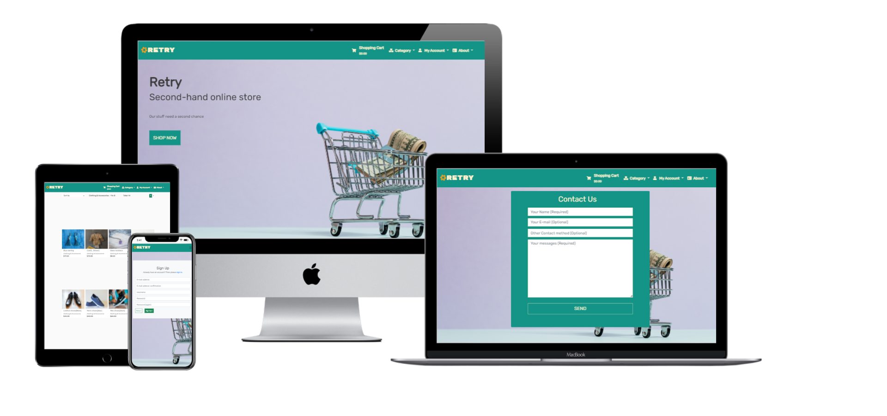

# Retry - A second-hand online store
# Portfolio Project 5
**Retry** is a online store provide second-hand product with online payment.\
User can purchase items from our collaborator and use stripe to complete online payment.\
They can also sign up to track their previous order payment and product status.

**Active website**: https://ci-portfolio-project-5.herokuapp.com/ \
**Git Repository**: https://github.com/cloki0610/CI-Portfolio-Project-5

## **Table of Contents**

* [User Experience Design](#User-Experience-Design)
* [Feature](#Feature)
* [Testing](#Testing)
* [Deployment](#Deployment)
* [Technologies](#Technologies)
* [Credits](#Credits)

 

## **User Experience Design**
### **The Strategy Plane**

The project is about to begin a business based on social media and community that cooperate with a different collaborator from organizations, groups, or individuals who want to sell their product and unwanted item in their name or anonymously. Each collaborator will work with us for a maximum of two months to sell their stuff products on our e-commerce platform. Our team will provide an online e-commerce platform, support their social media promotion, and deliver if collaborator needed in some special situation.

Based on the business strategy the e-commerce platform in the project will provide a solution to let users search and filter the products, store items into their shopping cart, create a new order, and complete the online payment. They could also sign up their account to track their previous order and manage their payment details. The application should have responsive design and have a nice layout on mobile and desktop browser.

 

#### **Site Goal**

 - Provide a full functional e-commerce platform with online payment.  
 - Provide user validation to let user create their own account with personal profile.  
 - User will be allowed to write a review to their previous order.
 - User will be allowed to  report the product which have problem.
 - User will get the core information about our business and previous collaborators.

 

#### **User Stories**

 
 

### **Scope Plane**

Planned Features the website should have:
 - Responsive Design
 - Navigation Bar
 - Category page to filter the type of contents
 - Search bar to search specific item(s)
 - User validation
 - Shopping cart
 - Payment method
 - Order review
 - Contact form

 

### **Structure Plane**

1. As a User, I want to be able to view a list of products, so that I can add my interested item to my cart.
2. As a User, I want to be able to view a specific category of products, so that I can easily find my interested products.
3. As a User, I want to be able to view individual product details, so that I can identify all information about the product.
4. As a User, I want to be able to view the total of my purchases at any time, so that I can know how much I would pay.
5. As a User, I want to be able to register my own account, so that I can be able to use my own profile to store my personal information.
6. As a Member/Admin, I want to be able to login or logout, so that I can access my profile, and purchase as of my own identity.
7. As a Member/Admin, I want to be able to recover my password in case I forget it, so that I can recover access to my account.
8. As a Member/Admin, I want to be able to receive an email confirmation after registering, so that I can verify that my account registration was successful.
9. As a Member/Admin, I want to be able to have a personalized user profile, so that I can check my personal order history, order confirmations, and save my payment information.
10. As a Member, I want to be able to remove my account so that I can feel free to be involved in the community and secure my information if needed.
11. As a Member, I want to be able to create/edit a review to my previous order, so that I can directly communicate with the store owner.
12. As a User, I want to be able to sort the list of available products, so that I can find the products by category, price or by name.
13. As a User, I want to be able to sort a specific category of product, so that I can find the products by price or by name.
14. As a User, I want to be able to search for a product by name or description, so that I can find my interested product easily.
15. As a User, I want to be able to see what I've searched for and the number of results, so that I can quickly decide whether the product I want is available.
16. As a User, I want to be able to select the quantity of a product when purchasing it, so that I can ensure I always select the correct product and quantity.
17. As a User, I want to be able to view all selected items in my shopping cart, so that I can know the total cost of purchase and the items I will receive.
18. As a User, I want to be able to adjust the quantity of items in my shopping cart, so that I can make edit my order before checkout.
19. As a User, I want to be able to enter my payment information on checkout page, so that I can check out with no hassles.
20. As a User, I want to be able to view an order confirmation after checkout, so that I can verify that I haven't made any mistakes.
21. As a User, I want to be able to receive an email confirmation after checking out, so that I can keep the confirmation of what I've purchased for my records.
22. As an Admin, I want to be able to add a product, so that I can add new items to my store.
23. As an Admin, I want to be able to update my products, so that I can change product prices, descriptions, images, and other product criteria.
24. As an Admin, I want to be able to delete a product, so that I can remove items that are no longer for sale.
25. As an Admin, I want to view list of the customer's contact detail and report, so that I can easily know customer's response.
25. As a User, I want to be able to report a problem product, so that the shop owner can know if there is some problem with their products.
26. As a User, I want to be able to leave my contact information and comment to the store owner, so that I can leave my feeling of the shop and try to connect with the shop owner personally.

### **Skeleton Plane**

#### **Wireframes**

#### **Database Design**

#### **Security**
With Heroku's config var feature, all sensitive keys that were stored in env.py are now stored in the Heroku server to prevent unwanted connections to the database or cloud service.

This project also uses Django allauth to set up a user authorization system to provide restricted access to certain features on the website that are not intended for unauthorized users.

All image file uploads from the user should store and be protected in AWS S3 storage.

### **Surface Plane**

#### **Color Sheme**
Background color: #fafafa\
font color: #3a3a3a\
Navbar background color: #139487\
Navbar font color: #FFF1CE\
Navbar icon color: #D29D2B

#### **Typography**

#### **Differences to Design**

## **Feature**
### **Existing Features**

 - Authentication system provided by allauth library.
 - Admin panel provided by Django framework with customized search and filter function.
 - Customer user profile.
 - Page for Error 404.
 - Page for Error 500.

### **Features Left to Implement**

## **Testing**
### Code Validation

### Manual test

### Automated test

### Issue found and solved

 

### Unsolved Issue

## **Deployment**
### **Create a new project**

## **Technologies**
### **Language**

 - HTML
 - CSS
 - JavaScript
 - Python

### **Libraries**
 - PostgreSQL
 - Bootstrap 5
 - JQuery
 - Google Fonts
 - Font Awsome
 - Stripe

  and those python libraries install with [requirements.txt](requirements.txt):
 - PostgreSQL
 - asgiref
 - dj-database-url
 - django-allauth
 - django-crispyforms
 - boto3 and django-storages
 - gunicorn
 - psycopg2
 - django-countries
 - Pillow
 - stripe

### **Project manage and deployment**
 - GitHub
 - Git
 - Heroku
### **Testing**
 - Google DevTool
 - WAVE Web Accessibility Evaluation Tool
 - [W3C Markup Validation Service](https://validator.w3.org/)
 - [W3C CSS](https://jigsaw.w3.org/css-validator/)
 - [PEP8 online](http://pep8online.com/)
### **Documentation**
 - Balsamiq Wireframes
 - DbVisualizer

## **Credits**
### **Code**
 - [Code Institute Buotique Ado walk-through project](https://github.com/cloki0610/boutique_ado_Walkthrough)

   I use quite a lot of code in my clone of the code institute project with some change to complete the purchase and payment flow.
 - [How to create a UserProfile form in Django with first_name, last_name modifications?](https://stackoverflow.com/questions/1727564/how-to-create-a-userprofile-form-in-django-with-first-name-last-name-modificati)

   To add the first name, last name and email to the profile form and edit them in user interface, I find this solution with some improvement to fulfill the requirement.
 - [My Project 4](https://github.com/cloki0610/CI-Portfolio-Project-4)

   I reuse some code from my previous project to create the view as class-based view, and complete my test cases of my web application.

## **Media**
 - Pexels

    All images come from and copyrighted by Pexels, the images will be remove or replaced if their policy have changed.
 - Flaticon

    The no image icon come from this website.

### **Acknowledgment**

