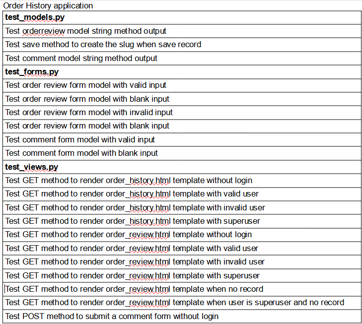

# Retry - A second-hand online store

# Portfolio Project 5

**Retry** is a online store provide second-hand product with online payment.\
User can purchase items from our collaborator and use stripe to complete online payment.\
They can also sign up to track their previous order payment and product status.

**Active website**: https://ci-portfolio-project-5.herokuapp.com/ (deprecated)\
**Git Repository**: https://github.com/cloki0610/CI-Portfolio-Project-5

## **Table of Contents**

- [User Experience Design](#User-Experience-Design)
- [Feature](#Feature)
- [Testing](#Testing)
- [Deployment](#Deployment)
- [Technologies](#Technologies)
- [Credits](#Credits)

 

## **User Experience Design**

### **The Strategy Plane**

The project is about to begin a business based on social media and community that cooperate with a different collaborator from organizations, groups, or individuals who want to sell their product and unwanted item in their name or anonymously. Each collaborator will work with us for a maximum of two months to sell their stuff products on our e-commerce platform. Our team will provide an online e-commerce platform, support their social media promotion, and deliver if collaborator needed in some special situation.

Based on the business strategy the e-commerce platform in the project will provide a solution to let users search and filter the products, store items into their shopping cart, create a new order, and complete the online payment. They could also sign up their account to track their previous order, manage their payment details, and directly connect with site admin through the platform. The application should also have a responsive design and have a nice layout on mobile and desktop browsers.

#### **Business Model**

The web application provide a B2C service to sell collaborator's products to customers. All the products might be provide by our collaborators from organizations, groups, or individuals except some promotions or some special marketing plan, that means we also provide B2B services to collaborators to provide them a platform to sell their items and customer support in both web marketing strategy and other related services. So in our plan we will contact those product providers to discuss about which product they would like to sell on our platform at first, then plan the web market strategy before our products on sale. At last the web application will handle selling and payment process for the end customer.

### **Marketing**

The web application has its own Facebook Business page, and the link to the facebook page can be found on about page.

We have a seperate subscribe page to let all user's subscribe our newsletter.

We also send the newsletter with secret code to provide discount to our members. We also work with some influencer to advert our web store.

### **Search Engine Optimisation**

The sitemap.xml generate by [xml-sitemaps](https://www.xml-sitemaps.com/), and the web application have its own robots.txt file, some keywords was also added to the meta tag on the page header.

 

#### **Site Goal**

- Provide a fully functional e-commerce platform with online payment.
- Provide user validation to let user create their account with a personal profile.
- Provide review and a 1:1 communication platform to review and discuss their order.
- Provide a report page to unauthenticated users to report the product which has a problem.
- Provide a page to let all users subscribe to newsletters and submit contact details.

 

### **Scope Plane**

Planned Features the web application should have:

- Responsive Design
- Navigation Bar
- Category page to filter the type of contents
- Sort option
- Search bar to search specific item(s)
- Paginator to split product list to different pages
- Shopping cart
- Payment method
- User validation
- Personal user profile
- Order review
- Comment section in review page
- Contact form
- News letter subscription

 

### **Structure Plane**

User story:

> As a User, I want to be able to view a list of products, so that I can add my interested item to my cart.

Acceptance Criteria:

- The product page should display a full list of products, and display some detail of these products with a friendly user interface.

Implementation:

- User can click the link on the landing page or nav bar to visit the full item list.
- The products data is split into a few pages divided by the paginator.
- Each item will display its name, price, the category with the product image in a card component.
- User can click the card to visit the detail page to add the item to the cart or report the product if needed.

 

User story:

> As a User, I want to be able to view a specific category of products, so that I can easily find my interested products.

Acceptance Criteria:

- User should be able to filter the product list by category by clicking a link or button to view the list of items in a specific category.

Implementation:

- User can click the link on the navbar to view the product list filter by category.
- The product list is split into a few pages divided by the paginator.
- The filter parameter will save in the context of the paginator links.

 

User story:

> As a User, I want to be able to view individual product details, so that I can identify all information about the product.

Acceptance Criteria:

- When users click on the relevant link, they should be able to view the full detail of the product with the product image.

Implementation:

- When users click on the link on the product card, they will be able to visit the product detail on the product_detail template.
- The product detail page will display the full detail of products, with quantity form, add product button, return link, and link to report page.

 

User story:

> As a User, I want to be able to view the total of my purchases at any time, so that I can know how much I would pay.

Acceptance Criteria:

- Users should be able to see their current total cost on every page.

Implementation:

- On the shopping cart navbar link, the current total cost will display below the 'shopping cart' text.
- On the mobile version, the total cost will display with the link in the same line.
- There is also have a badge to display how many types of item customer purchase if their cart has an item.

 

User story:

> As a User, I want to be able to register my own account, so that I can be able to use my own profile to store my personal information.

Acceptance Criteria:

- User should be able to register a new account to use some features only provide to an authenticated user.

Implementation:

- All features related to user authentication are provided by the allauth library.
- The template style by bootstrap 5 and the folder are placed under templates folder.
- The 'Sign Up' link is shown on the account sub-navbar.

 

User story:

> As a Member/Admin, I want to be able to login or logout, so that I can access my profile, and purchase as of my own identity.

Acceptance Criteria:

- Users should be able to log in and log out to use the services as a guest or registered users based on their requirements.

Implementation:

- All features related to user authentication are provided by the allauth library.
- The template style by bootstrap 5 and the folder are placed under the templates folder.
- The 'Sign In' and 'Sign Out' links show on the account sub-navbar, if the user successfully login, the sign-out link will display, and the sign-in link will hide and vice versa.

 

User story:

> As a Member/Admin, I want to be able to recover my password in case I forget it, so that I can recover access to my account.

Acceptance Criteria:

- Users should be able to recover their password by inputting a valid e-mail address, and they should be able to receive an email to set up a new account to access their account.

Implementation:

- All features related to user authentication are provided by allauth library.
- The template style by bootstrap5 and the folder are placed under the templates folder.
- The link is displayed on the sign-in template. The link is the only way user can click to visit the password reset page to use this feature.

 

User story:

> As a Member/Admin, I want to be able to receive an email confirmation after registering, so that I can verify that my account registration was successful.

Acceptance Criteria:

- After successful registration, the user and admin should be able to receive an e-mail, and only allow them to log in after confirmation.

Implementation:

- When a user registers a new account, the function provided by allauth library will send an e-mail to the user.
- E-mail account provided by Google, and the information about the e-mail and the pass secret key store in the eny.py and Heroku.

 

User story:

> As a Member/Admin, I want to be able to have a personalized user profile, so that I can check my personal order history, order confirmations, and save my payment information.

Acceptance Criteria:

- Users should be able to visit a profile page to check their profile details and order history.

Implementation:

- A userprofile data model creates in the profiles application.
- Some view to handle all of the get and post methods to visit the profile page and post data to manage their record.
- Templates style by customer CSS and bootstrap5 styles the user interface.
- Users can edit and submit their profile on the left side of the page, and check their order history on the right side.
- Below the profile form, there is a button to submit the form and a link to remove the account if the user is not a superuser.

 

User story:

> As a Member, I want to be able to remove my account so that I can feel free to be involved in the community and secure my information if needed.

Acceptance Criteria:

- Authorized users should be about to click the delete account on the profile page to remove their account.

Implementation:

- Below the profile form, if the user is not a superuser they will see the 'delete account' button next to the submit button.
- Once they click the button, they will visit a confirm page with some warning message.
- They can also click the return button to return to the profile page.
- Once they click the delete button, a modal component will pop up for the final confirmation.
- Users can close the modal and back to the page. If users click the delete button in the modal, their account will be removed, and they will redirect to the landing page.
- The related message should show up once the action is complete.

 

User story:

> As a Member, I want to be able to create/edit a review to my previous order, so that I can directly communicate with the store owner.

Acceptance Criteria:

- Users should be able to create an order review to provide some feedback about their order.
- The review page should have a section to show all comments about the review.
- Only customers who place the order and the superuser allow to visit the review record.

Implementation:

- Users can create a new review on their profile, or visit the review page if a record exists.
- On the review page, they can see the details of their review, or click the update/delete link to manage their record.
- Users can leave a comment on the review page by submitting the comment form.
- All comments will display on the right side of the review page.

 

User story:

> As a User, I want to be able to sort the list of available products, so that I can find the products by category, price or by name.

Acceptance Criteria:

- Users should be able to sort the product list to easily search for the product they need.

Implementation:

- The sort select box is placed on top of the product list, in the same line with result details and paginator.
- User can sort the result by name, price, and category name.
- The parameter will save in the context of the paginator links.

 

User story:

> As a User, I want to be able to sort a specific category of product, so that I can find the products by price or by name.

Acceptance Criteria:

- After clicking the link to filter the result by category, the users should be able to sort the result by price or by name.

Implementation:

- The sort select box is still placed in the same place as before in the filter result.
- The parameter will save in the context of the paginator links.

 

User story:

> As a User, I want to be able to search for a product by name or description, so that I can find my interested product easily.

Acceptance Criteria:

- Users should be able to search the product by name or description and get the result to find the product they need.

Implementation:

- The search bar create by an input box and submit button.
- The search bar is placed on the sub-menu of the navbar in the desktop version.
- The search bar is placed below the title in the mobile version.
- User can input some text to search the product by product name and description.
- If users submit the form with blank input, they will see some warning message.

 

User story:

> As a User, I want to be able to see what I've searched for and the number of results, so that I can quickly decide whether the product I want is available.

Acceptance Criteria:

- User should be able to see the number of the search result on the product page.

Implementation:

- The number of results is displayed on the same line with the sorting box and the paginator.

 

User story:

> As a User, I want to be able to select the quantity of a product when purchasing it, so that I can ensure I always select the correct product and quantity.

Acceptance Criteria:

- Users should be able to see the current item quantity they select and change the item quantity by input or button.

Implementation:

- Add two buttons around the input field to change the quantity.
- Add javascript to make these new buttons functional.
- If the selected quantity is less than one or more than 99, the related button will be disabled.

 

User story:

> As a User, I want to be able to view all selected items in my shopping cart, so that I can know the total cost of purchase and the items I will receive.

Acceptance Criteria:

- Users should be able to view a complete list of the item they have added to their shopping cart.

Implementation:

- Create a context file to create a dictionary to store the added item.
- When users click the link on the navbar, they will see a complete list of the items they added.
- The shopping cart page should have a button to return to the shop, a button to adjust and remove products, and a button to the payment page.

 

User story:

> As a User, I want to be able to adjust the quantity of items in my shopping cart, so that I can make edit my order before checkout.

Acceptance Criteria:

- Users should be able to adjust every item they put into the shopping cart on the shopping cart page.

Implementation:

- Reuse the existed quantity form and javascript.
- Edit the existing javascript to handle all buttons on the shopping cart page.
- If the quantity is zero, the selected item will remove from the shopping cart.

 

User story:

> As a User, I want to be able to enter my payment information on checkout page, so that I can check out with no hassles.

Acceptance Criteria:

- Users should be able to enter their payment information on the checkout page to submit the payment and delivery information.

Implementation:

- On the left side of the checkout page, users can submit a form to provide the payment detail.
- If the form is valid, the payment information will send to stripe by webhook, and the order record will store in the database.
- If the user is authorized, they will allow press a checkbox to save their payment information to save their input to their profile.

 

User story:

> As a User, I want to be able to view an order confirmation after checkout, so that I can verify that I haven't made any mistakes.

Acceptance Criteria:

- After a successful checkout, the user should be able to see the record about their successful purchase.

Implementation:

- Order and order item records will create to store all purchase records.
- After checkout, the user should redirect to the checkout_success page.
- The page will get the order record from the database and display it on the template.

 

User story:

> As a User, I want to be able to receive an email confirmation after checking out, so that I can keep the confirmation of what I've purchased for my records.

Acceptance Criteria:

- User should receive an email after checkout with order details.

Implementation:

- The email content is created and stored in the checkout application's template file.
- Once the purchase is complete, the stripe webhook will send an email from my google account.

 

User story:

> As an Admin, I want to be able to add a product, so that I can add new items to my store.

Acceptance Criteria:

- Website admin should be able to submit a valid form to add a new product for sale.

Implementation:

- If the user is not a superuser, access will be denied and redirect to the home page.
- If the input is invalid, some message will show up.
- If the input is valid, the user will redirect to the new product's product detail page.
- The link to add product will display in the submenu of 'account' and only show up when the user is a superuser.

 

User story:

> As an Admin, I want to be able to update my products, so that I can change product prices, descriptions, images, and other product criteria.

Acceptance Criteria:

- Website admin should be able to submit a valid form to update an existing product.

Implementation:

- The page is familiar with the add product page.
- If the user is not a superuser, access will be denied and redirect to the home page.
- If the input is invalid, some message will show up.
- If the input is valid, the user will redirect to the new product's product detail page.
- The link to update the product will display on the product detail page and at the bottom of the product card component
- The button only shows up when the user is a superuser.

 

User story:

> As an Admin, I want to be able to delete a product, so that I can remove items that are no longer for sale.

Acceptance Criteria:

- Website admin should be able to delete an existing product to let the customer know it is not for sale anymore.

Implementation:

- When the admin clicks the delete button, they will redirect to a confirm page.
- The admin can click the link to return to the product detail page, or press the delete button to remove the product.
- The link to update the product will display on the product detail page and the bottom of the product's card component.
- The button only shows up when the user is a superuser.

 

User story:

> As a User, I want to be able to report a problem product, so that the shop owner can know if there is some problem with their products.

Acceptance Criteria:

- User should be able to submit a form to report a product with some problem, whether authorized or not.

Implementation:

- Use can submit a report data to the database to report a product.
- The link to the report form is on the product_detail page.

 

User story:

> As a User, I want to be able to leave my contact information and comment to the store owner, so that I can leave my feeling of the shop and try to connect with the shop owner personally.

Acceptance Criteria:

- User should be able to submit a form with some data to allow the admin to contact the user out of the web application.

Implementation:

- A contact data model create to store the contact details.
- A form can allow the user to submit data about their contact details.
- The link to the contact form is in the about submenu in the navbar.

 

User story:

> As an Admin, I want to view details of the customer's contact detail and report, so that I can easily know customer's response.

Acceptance Criteria:

- The admin should be able to view a list of contact detail and report to view all data in these tables.

Implementation:

- Contact detail page display the full details and style with bootstrap and jquery animation.
- Report list-style as a bootstrap component, and divide by paginator.
- Report list provides a toggle button to mark the report as checked or not.
- The links to these lists are displayed in the sub-menu of the account menu in the navbar.

 

User story:

> As a User, I want to be able to leave my e-mail address to the store owner, so that I can recieve their news letter to get more information about their latest products or activities.

Acceptance Criteria:

- Users should be able to submit their e-mail address to the admin to subscribe to the newsletter for the latest information.

Implementation:

- A simple form with a field can allow users to send their e-mail addresses to the database.
- The link to the newsletter page will place in the submenu in the about menu.

 

### **Skeleton Plane**

#### **Wireframes**
 - index

 

 - products

 

 - product_detail

 

 - add_product

 

 - edit_product

 
 
 - delete_product_confirm

 
 
 - checkout

 

 - checkout_success
 
 

 - cart
 
 

 - profile
 
 

 - delete_account
 
 

 - order_list
 
 

 - order_history
 
 

 - order_review
 
 

 - create_review
 
 

 - update_review
 
 

 - report
 
 

 - report_list
 
 

 - about
 
 

 - contact
 
 

 - newsletter
 
 

 - contact_list
 
 

 - email (allauth template)
 
 

 - password_reset (allauth template)
 
 

 - change_password (allauth template)
 
 

 - signin (allauth template)
 
 

 - signup (allauth template)
 
 

 - signout (allauth template)
 
 

#### **Database Design**

#### **Security**

With Heroku's config var feature, all sensitive keys like stripe and AWS secret key were stored in local env.py file are now stored in the Heroku server to prevent unwanted connections to the database or cloud service.

The project also uses Django allauth to set up a user authorization system to provide restricted access to certain features on the web application that are not intended for unauthorized users. Users need a valid e-mail to receive a confirmation e-mail to confirm their e-mail to log in as a member.

All image file uploads from the user should store and be protected in the AWS S3 bucket, but there is a limit of usage because it is still using AWS free tier service.

The project uses stripe to handle the payment method set up an account, and use the test service, the project will handle the security in the payment process. All the related secrets will store in env.py and Heroku. The project also uses their webhook feature to save the payment detail and send a confirmation e-mail after a successful payment, so endpoint settings are also created in the stripe account to resist the connection from others.

### **Surface Plane**

#### **Color Sheme**

Background color: #FAFAFA\
font color: #3A3A3A\
Navbar background color: #075E31\
Navbar font color: #FFF1CE\
Navbar icon color: #D29D2B

#### **Typography**

The Brand text on the navigation bar use 'Rubik Mono One' font, and the rest are all using 'Rubik' as the main font.

#### **Differences to Design**

- Every margin and padding maybe not be as expected at last. Because I only use the bootstrap feature to add these spaces to the box.

- I try my best to fix all button sizes, but there may be still some problems in my work.

- I use some icons from font awesome to replace the text at last.

## **Feature**

### **Existing Features**

- Authentication system provided by allauth library.
- Admin panel provided by Django framework with customized search and filter function.
- Customer user profile.
- Shopping cart using context and local storage
- Checkout and payment method provide by stripe
- Product list with filter, search and sorting
- Report form for all user and quest
- Contact form for all user and quest
- Full Order, Report and contact list only superuser can access
- Toggle button to check report list item checked or not
- Order review system to let user write some suggestion about their previous order
- A comment section in order review page only customer and superuser can use.
- Page for Error 404.
- Page for Error 500.

### **Features Left to Implement**

- Improve user interfaces
- Stock tracing system
- Alarm system to let admin and user know there are new message in the order review.

## **Testing**

### Code Validation

- HTML Code basically passes through the W3C HTML Validator by using the source code get from DevTool.
- CSS Code in every static folder pass through the W3C CSS Validator.
- Python Code passes through PEP8 Validator.
- Lighthouse in Chrome Dev Tools have been used to test the performance of the web application.

### Manual test

- Google Chrome developer tools and WAVE Web Accessibility Evaluation Tool used for layout testing and solve style and display issues, to solve the contrast warning the navbar color was changed to a deeper color.
- Github Project has been used to track tasks. I used to check the task completion through the process.
- All links were tested with or without login during the development process and tested again after deployment.
- Every field in the forms was tested to ensure that they work as they should.
- I also tested every pages in different sizes of the screen by Google Chrome developer tools and the layouts are seems fine.
- Error 404 and 500 page work as expected.

### Automated test

There are a total of 168 test cases that used test libraries provided by Python and supported by the Django framework to test the view, form models, and data models in all of the applications. Details of test cases are listed below.

- home application

- products application

- checkout application

- cart application

- profiles application

- order_history application

- about application

- report application

### Issue found and solved

- I accidentally use the wrong logic and denied the customer to access their order review page. Problem fixed after it was spotted.
- Some type error was found and fixed.
- Some close tag duplicates because of IDE auto-input feature, I spot these errors by W3 HTML validator and fix it after that.
- Overflow problem caused by font size and padding. Related CSS and bootstrap were changed to fix most of these problems, I tried my best to solve all of them.

 

### Unsolved Issue

- Maybe there are still some risks or security problems there but I've tried my best to fix them.
- I fixed some overflow problems because of padding or font size but maybe a few of them are still there.

## **Deployment**

### **Create a new project**

1. First, I use Code Institute gitpod full template to generate my new project.
2. Then I open the new project by gitpod
3. After a new workspace is opened, I follow the cheat sheet to install Django and all required libraries.
4. Use 'pip3 freeze --local > requirements.txt' to generate requirements.txt file.
5. Then I commit my files to the GitHub repository to make my initial commit.

### Deploy to Heroku

1. Log in to Heroku account.
2. Click the 'New' button on the dashboard and click 'create a new app'
3. Enter the project name and select the region
4. Click the 'create app' button
5. To resources tag, Add-ons, search and add 'Heroku Postgres', I choose the free version for this project.
6. To deploy tag, Deployment method and connect the GitHub project to Heroku.
7. Then go to Setting tag, Config Vars, I copy the database link of the new Heroku Postgres to the setting.py file in my project.
8. Then I generate a new project secret key and copy it into my eny.py and Heroku's config var.
9. Copy the link to env.py in the workspace, a file will not be tracked for development use to run the webpage locally.
10. Then log in to my AWS account, for this project I create my user, user group, and policy by IAN and create a new bucket by S3.
11. Copy the access key id and its secret key and save into Heroku's config var as 'AWS_ACCESS_KEY_ID' and 'AWS_SECRET_ACCESS_KEY', and create a 'USE_AWS' variable and set it to 'True'
12. Set up a stripe account, get and copy the public key and secret key, and save these keys to Heroku's config var as 'STRIPE_PUBLIC_KEY' and 'STRIPE_SECRET_KEY'.
13. In the stripe account, create an endpoint for the deploy version domain address, and save the webhook key as 'STRIPE_WH_SECRET' in the Heroku's config var.
14. Then add 'DISABLE_COLLECTSTATIC' and set the value as 1 to config vars, when development is complete, this variable will be removed.
15. Then add all the related settings to the setting.py in my workspace to connect the stripe and AWS S3 Bucket.
16. I use my spare google account to send the email, after I get my pass secret from my google account, I copy it into Heroku's config var as 'EMAIL_HOST_PASS' and set the email address as 'EMAIL_HOST_USER'.
17. After completing the initial settings, I create the Procfile, commit and push to the main branch.
18. Then to deploy tag, Manual Deploy, click the deploy branch to deploy my main branch.
19. When everything is complete, I change the 'DEBUG' variable in setting.py to 'False' before final deploy and remove the 'DISABLE_COLLECTSTATIC' variable in Heroku's Config Vars.

## **Technologies**

### **Language**

- HTML
- CSS
- JavaScript
- Python

### **Libraries**

- PostgreSQL
- Bootstrap 5
- JQuery
- Google Fonts
- Font Awsome
- Stripe

and those python libraries install with [requirements.txt](requirements.txt):

- PostgreSQL
- asgiref
- dj-database-url
- django-allauth
- django-crispyforms
- boto3 and django-storages
- gunicorn
- psycopg2
- django-countries
- Pillow

### **Project manage and deployment**

- GitHub
- Git
- Heroku
- AWS S3 Bucket

### **Testing**

- Google DevTool
- WAVE Web Accessibility Evaluation Tool
- [W3C Markup Validation Service](https://validator.w3.org/)
- [W3C CSS](https://jigsaw.w3.org/css-validator/)
- [PEP8 online](http://pep8online.com/)

### **Documentation**

- Balsamiq Wireframes
- DbVisualizer

## **Credits**

### **Code**

- [Code Institute Buotique Ado walk-through project](https://github.com/cloki0610/boutique_ado_Walkthrough)

  I use quite a lot of code in my clone of the code institute project with some changes to complete the purchase and payment flow. I also reuse some related data models to finish the project.

- [My Project 4](https://github.com/cloki0610/CI-Portfolio-Project-4)

  I reuse some code from my previous project to create the view as a class-based view and complete the unit tests of my web application.

- [Django document](https://docs.djangoproject.com/en/4.0/)

  I try to create some views with Django generic view for more understanding in Django, so I get some idea from the example to try the generic class-based views.

## **Media**

- Pexels

  All images come from and are copyrighted by Pexels, the images will be removed or replaced if their policy has changed.

- Flaticon

  The no image icon comes from this website.

### **Acknowledgment**

- Thanks to my mentor Daisy McGirr for all support in the process. Without her guidance and encouragement, I will never get this far. Words cannot express my gratitude for all of it.
- The StackOverflow community already has the answers I need, thanks the community helped me solve most of my problems before I ask it.
- Thanks to Code Institute's Slack community for some examples and answers already in the chat record so that save some time fix some problems like the webhook endpoint and its testing in the project's early stage.
